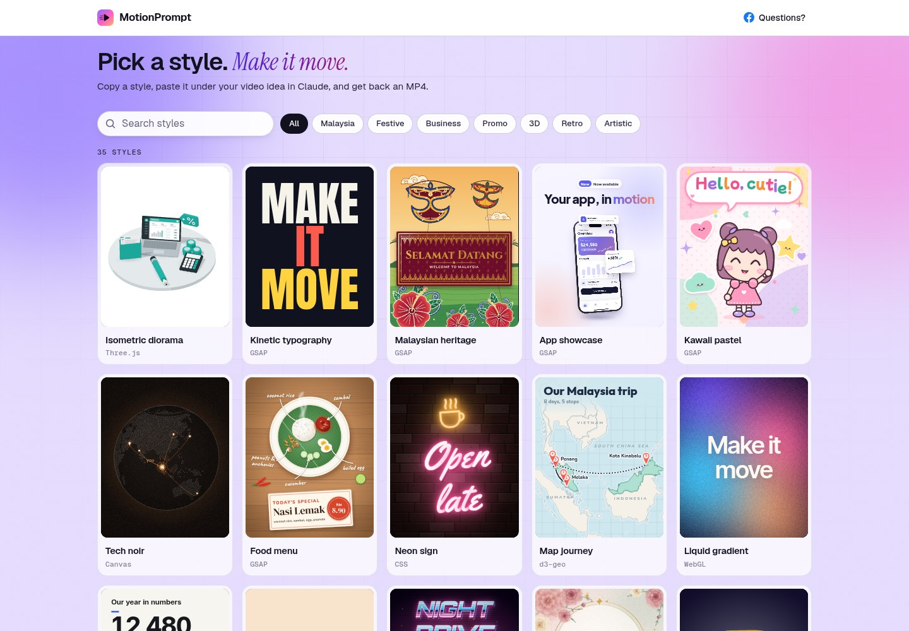

# MotionPrompt

**Pick a style. Make it move.**

Free animated video styles for Claude. Pick a style, copy its prompt, paste it under your
video idea in Claude, and get back a finished MP4. No editing app, no designer.

**Live site:** https://epool86.github.io/motionprompt/

[](https://epool86.github.io/motionprompt/)

## How to use it

1. **Pick a style.** Open the site and browse the gallery. Every card is a live demo. Tap one to
   open it.
2. **Set it up.** Choose the video format (9:16 for Reels and TikTok, 4:5, 1:1 or 16:9 for
   YouTube), the size, the length, and whether you want sound effects or music.
3. **Copy the style.** Press **Copy** on the style prompt.
4. **Paste it into Claude.** Write what your video is about, then paste the style below it.
   For example:

   ```
   Make a video for my bakery's grand opening this Saturday.
   Text: Fresh bread. Warm coffee. Grand opening.

   (paste the style here)
   ```

5. **Get your MP4.** Claude builds the animation and sends back the video file.

## Tips

- **Claude on the web** works well for most videos. For long or heavy videos, use
  **Claude Code** on your computer, because it has no time limit on rendering.
- **Attach files** to your message: your logo, product photos or app screenshots. Many styles
  use them.
- **Brand colours:** add them to your request (for example "use #5b3cf0 and #ff5fc8") and the
  style will follow them.
- Not happy with the result? Ask Claude for changes: "slower", "bigger text", "add my logo at
  the end".

## Run it locally

It is a plain static site (HTML, CSS and JavaScript, no build step). Serve the folder with any
web server and open `index.html`:

```bash
npx serve .          # or: python3 -m http.server
node scripts/check.mjs   # checks the styles before you commit
```

Each style lives in `styles/<name>/` with a live `demo.html` and a `prompt.txt`, and is listed
in `styles/styles.json`. Notes for adding styles are in `CLAUDE.md`.

## Credits

Made by [Ahmad Saiful Bahri](https://www.facebook.com/asbahri), built together with Claude.
The demos, sound effects and the launch music ("Make It Move") were all made with code.
